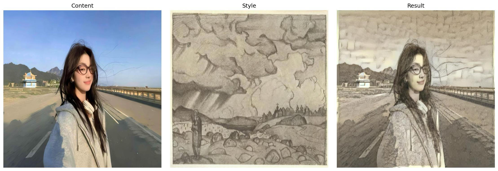
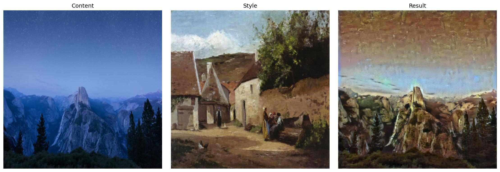

# 神经网络风格迁移项目文档

## 1. 项目背景

本项目是一个完整且功能丰富的**神经网络风格迁移（Neural Style Transfer, NST）**解决方案。

神经网络风格迁移是一种深度学习技术，其目标是将一张“风格图像”（如梵高的《星夜》）的艺术风格应用到一张“内容图像”（如一张风景照）上，生成一张新的、融合了两者特点的图像。

传统的风格迁移往往只是一个简单的Python脚本，而本项目将其扩展为一个**全功能的、用户友好的应用**。它不仅包括了核心的图像处理算法，还集成了**Gradio Web界面**、**高级视频风格迁移** 以及**智能风格推荐系统**，旨在为用户提供一个从选择风格到生成最终作品（无论是图片还是视频）的完整工作流。

## 2. 核心原理：VGG19

本项目的核心算法完全建立在对一个预训练的卷积神经网络（CNN）——**VGG19**——的巧妙运用之上。VGG19是整个风格迁移过程的“大脑”和“眼睛”，它负责“看懂”内容和风格，并指导新图像的生成。

### 2.1 为什么选择VGG19？

VGG19是一个深度卷积神经网络，它包含19个层（16个卷积层和3个全连接层）。本项目使用的是在ImageNet数据集上预训练过的VGG19模型。

选择它的关键原因在于：
* **预训练特性**：它已经在数百万张图像上进行过训练，使其能够识别从简单边缘到复杂物体（如动物、建筑）的丰富特征。我们利用它已经学到的这种“理解”能力，而**不需要**对VGG19本身进行任何重新训练。
* **层级特征**：VGG19的深层结构具有一个重要特性——**网络的不同深度（层）会捕捉到不同抽象级别的图像信息**。
    * **浅层网络**（如 `conv_1`）对像素级的细节（如边缘、颜色）更敏感。
    * **深层网络**（如 `conv_4`）对图像的整体内容和布局（如物体的形状）更敏感。

本项目正是利用了VGG19的这种层级特征分离能力。在代码中，模型被设置为评估模式（`.eval()`），其所有权重都被“冻结”，只作为特征提取器使用。

### 2.2 VGG19如何“看懂”内容？

* **原理**：随着网络加深，VGG19会逐渐忽略图像的纹理和颜色，转而关注其高级的语义内容（“*是什么*”）。
* **实现**：本项目选择了一个较深的卷积层——`conv_4`——作为内容代表层。
* **损失计算**：
    1.  我们将“内容图像”输入VGG19，并提取其在 `conv_4` 层的特征图（Feature Map）。
    2.  在优化过程中，我们将“生成图像”也输入VGG19，并提取同一层的特征图。
    3.  **内容损失（Content Loss）**被定义为这两组特征图之间的**均方误差（MSE）**。这个损失值越小，说明生成图像在“内容结构”上越接近原始的内容图像。

### 2.3 VGG19如何“看懂”风格？

* **原理**：风格（如笔触、纹理、配色）被认为是一种全局特征，它不关心物体在哪里，只关心“*看起来怎样*”。在CNN中，这表现为不同特征通道之间的**相关性**。
* **实现**：
    1.  本项目选择了一系列VGG层（`conv_1`, `conv_2`, `conv_3`, `conv_4`, `conv_5`）来共同代表风格。
    2.  对于每一层，我们计算特征图的**格拉姆矩阵（Gram Matrix）**。这个矩阵通过计算特征图通道间的内积，有效地捕捉了哪些特征（如不同方向的边缘、不同颜色）倾向于“同时出现”，从而量化了图像的纹理和风格，同时丢弃了空间布局信息。
* **损失计算**：
    1.  我们将“风格图像”输入VGG19，在上述每个风格层计算其Gram矩阵，并将其保存为“目标风格”。
    2.  在优化过程中，我们对“生成图像”做同样的操作。
    3.  **风格损失（Style Loss）**被定义为“生成图像”的Gram矩阵与“目标风格”的Gram矩阵之间的**均方误差（MSE）**。
    4.  总的风格损失是所有选定层风格损失的加权总和。

### 2.4 优化过程

风格迁移的本质是一个**优化问题**。

1.  **初始化**：我们从一张图像开始（本项目中使用内容图像的副本）。
2.  **动态建模**：项目动态地构建了一个新模型，它包含了VGG19的各层，并在指定位置插入了`ContentLoss`和`StyleLoss`模块。
3.  **迭代优化**：使用`LBFGS`优化器，不断地微调“生成图像”的**每一个像素**。
4.  **目标**：优化的目标不是调整VGG19的权重，而是调整“生成图像”本身，使其在VGG19的"眼中"看来，能够同时最小化**内容损失**和**风格损失**的总和。

经过数百步迭代，这张“生成图像”就会奇妙地收敛，既保留了内容的结构，又披上了风格的外衣。

## 3. 智能：风格推荐系统

此功能旨在解决用户“不知道该用什么风格”的难题。它通过一个基于色彩特征匹配的规则系统来实现。

* **实现原理**：
    * **步骤1：建立风格档案**：项目内置一个“风格特征库”，其中为多种艺术风格（如“印象派”、“立体主义”、“巴洛克”等）预先定义了其典型的色彩倾向。每种风格都有一个理想的**色调范围** (Hue)、**饱和度范围** (Saturation) 和**亮度范围** (Brightness)。
    * **步骤2：分析内容图像**：当用户上传一张内容图片时，系统会将其从RGB色彩空间转换到HSV（色调、饱和度、亮度）色彩空间。
    * **步骤3：提取色彩特征**：系统计算该图像的**平均色调**、**平均饱和度**和**平均亮度**等关键统计数据。
    * **步骤4：计算匹配分数**：系统会遍历风格库中的每一种风格，将图像的色彩特征（例如，平均饱和度为0.7）与该风格档案的理想范围（例如，“印象派”的饱和度范围为 [0.6, 1.0]）进行比较。
    * **步骤5：生成推荐**：根据图像特征与风格档案的贴合程度，系统会计算出一个加权的**匹配分数**。最后，系统按分数高低对所有风格进行排序，并向用户推荐匹配度最高的Top-K个风格。

## 4. 项目功能汇总

本项目提供了一个从入门到高级的完整风格迁移工具链：

1.  **核心：图像风格迁移**
    * 支持对单张图片进行高质量的风格迁移。
    * 支持自定义内容权重、风格权重、图像尺寸和迭代步数。

2.  **智能：风格推荐系统**
    * 分析用户图像的色彩特征，自动推荐最匹配的艺术风格。

3.  **丰富：WikiArt数据集集成**
    * 内置 `StyleImageLoader`，可从 `WikiArt` 数据集中按风格或艺术家随机抽取艺术作品作为风格来源。
    * 极大扩展了风格库，用户不再局限于自己寻找风格图片。

4.  **高效：命令行工具集**
    * **批量处理**：支持文件夹对文件夹的批量渲染。
    * **文件管理**：方便地通过命令行管理本地的素材库。
    * **快速启动**：一键检查环境并启动项目。